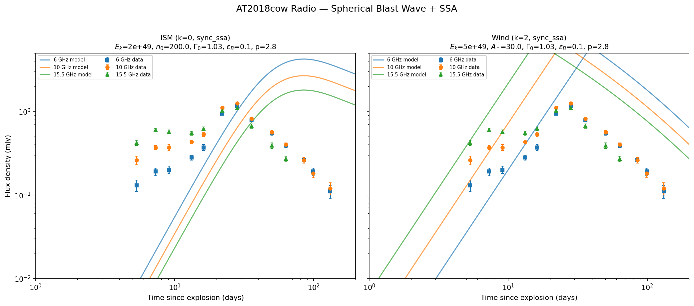

# AT2018cow: Modeling an FBOT with a Spherical Blast Wave

This example demonstrates the `Spherical` profile and general-$k$ CSM density by modeling the radio emission from the fast blue optical transient (FBOT) AT2018cow.

## Background

AT2018cow was a luminous, rapidly evolving transient at 60 Mpc ($z = 0.0141$) discovered in June 2018. Its bright radio emission is well-explained by synchrotron radiation from a mildly relativistic ($v \sim 0.1$--$0.3c$), quasi-spherical blast wave expanding into a dense circumburst medium.

Key references:

- Ho et al. 2019, ApJ, 871, 73 --- VLA radio light curves and equipartition analysis
- Margutti et al. 2019, ApJ, 872, 18 --- multi-wavelength modeling, wind-stratified CSM

## Radio data

We use VLA radio data from Ho+2019 at three frequencies:

```python
import numpy as np

# Time in days since explosion, flux (mJy), error (mJy)
data_10GHz = np.array([
    [5.32,  0.26,  0.03], [7.30,  0.37,  0.02], [9.10,  0.37,  0.03],
    [13.23, 0.43,  0.02], [16.14, 0.53,  0.03], [22.07, 1.11,  0.03],
    [28.21, 1.25,  0.05], [35.86, 0.82,  0.03], [50.16, 0.56,  0.03],
    [63.36, 0.40,  0.02], [84.95, 0.26,  0.02], [99.20, 0.18,  0.02],
    [131.5, 0.12,  0.02],
])

data_6GHz = np.array([
    [5.32,  0.13,  0.02], [7.30,  0.19,  0.02], [9.10,  0.20,  0.02],
    [13.23, 0.28,  0.02], [16.14, 0.37,  0.03], [22.07, 0.94,  0.03],
    [28.21, 1.15,  0.04], [35.86, 0.79,  0.03], [50.16, 0.55,  0.03],
    [63.36, 0.39,  0.02], [84.95, 0.26,  0.02], [99.20, 0.19,  0.02],
    [131.5, 0.11,  0.02],
])

data_15GHz = np.array([
    [5.32,  0.42,  0.03], [7.30,  0.60,  0.03], [9.10,  0.57,  0.03],
    [13.23, 0.55,  0.03], [16.14, 0.62,  0.03], [22.07, 1.02,  0.04],
    [28.21, 1.10,  0.05], [35.86, 0.67,  0.04], [50.16, 0.39,  0.03],
    [63.36, 0.27,  0.02],
])
```

The light curves show a characteristic rise--peak--decline shape: the rise is driven by **synchrotron self-absorption** (SSA), with the peak occurring when the SSA frequency sweeps through the observing band. This means we must use the `"sync_ssa"` radiation model.

## Physical parameters

AT2018cow's radio emission is consistent with a sub-relativistic, quasi-spherical outflow:

| Parameter | ISM model | Wind model | Notes |
|-----------|-----------|------------|-------|
| \(E_k\) | \(2 \times 10^{49}\) erg | \(5 \times 10^{49}\) erg | Kinetic energy |
| \(\Gamma_0\) | 1.1 | 1.03 | Mildly relativistic |
| \(n_0\) / \(A_*\) | 100 \(\mathrm{cm}^{-3}\) | 20 | Dense CSM |
| \(k\) | 0 | 2 | Density profile index |
| \(\varepsilon_e\) | 0.1 | 0.12 | Electron energy fraction |
| \(\varepsilon_B\) | 0.03 | 0.05 | Magnetic energy fraction |
| \(p\) | 2.8 | 2.8 | Electron spectral index |
| \(d\) | 60 Mpc | 60 Mpc | Luminosity distance |
| \(z\) | 0.0141 | 0.0141 | Redshift |

!!! note
    The high density reflects a dense CSM from pre-explosion mass loss, not the diffuse ISM. This is typical for FBOTs which are thought to occur in dense environments.

## Computing the model

```python
from blastwave import FluxDensity_spherical

DAY = 86400.0

P = {
    "Eiso": 2e49, "lf": 1.1,
    "A": 0.0, "n0": 100.0,
    "eps_e": 0.1, "eps_b": 0.03, "p": 2.8,
    "theta_v": 0.0, "d": 60.0, "z": 0.0141,
}

t_model = np.geomspace(1.0 * DAY, 200.0 * DAY, 150)

F_6  = FluxDensity_spherical(t_model, 6e9  * np.ones_like(t_model), P,
                              k=0.0, tmin=1.0, tmax=300*DAY, model="sync_ssa")
F_10 = FluxDensity_spherical(t_model, 10e9 * np.ones_like(t_model), P,
                              k=0.0, tmin=1.0, tmax=300*DAY, model="sync_ssa")
F_15 = FluxDensity_spherical(t_model, 15.5e9 * np.ones_like(t_model), P,
                              k=0.0, tmin=1.0, tmax=300*DAY, model="sync_ssa")
```

Key choices:

- **`Spherical` profile** --- uniform energy at all angles, triggers the tophat fast path (1-cell solve)
- **`k=0.0`** --- constant-density CSM (ISM-like)
- **`model="sync_ssa"`** --- synchrotron self-absorption is essential for the radio rise
- **`spread=False`** --- no lateral spreading (set automatically by `FluxDensity_spherical`)

## Plotting

```python
import matplotlib.pyplot as plt

fig, ax = plt.subplots(figsize=(8, 6))
t_days = t_model / DAY

# Data
ax.errorbar(data_6GHz[:, 0],  data_6GHz[:, 1],  yerr=data_6GHz[:, 2],
            fmt='s', color='C0', label='6 GHz', capsize=2, ms=5)
ax.errorbar(data_10GHz[:, 0], data_10GHz[:, 1], yerr=data_10GHz[:, 2],
            fmt='o', color='C1', label='10 GHz', capsize=2, ms=5)
ax.errorbar(data_15GHz[:, 0], data_15GHz[:, 1], yerr=data_15GHz[:, 2],
            fmt='^', color='C2', label='15.5 GHz', capsize=2, ms=5)

# Model
ax.plot(t_days, F_6,  '-', color='C0', alpha=0.7)
ax.plot(t_days, F_10, '-', color='C1', alpha=0.7)
ax.plot(t_days, F_15, '-', color='C2', alpha=0.7)

ax.set_xscale('log')
ax.set_yscale('log')
ax.set_xlabel('Time since explosion (days)')
ax.set_ylabel('Flux density (mJy)')
ax.set_title('AT2018cow Radio — Spherical blast wave + SSA')
ax.legend()
ax.set_xlim(1, 200)
ax.set_ylim(0.01, 5)
plt.tight_layout()
plt.savefig('at2018cow_radio.png', dpi=150)
```



## Discussion

The simple spherical blast wave model captures the qualitative behavior:

- **SSA-driven rise** at early times when the source is compact and optically thick
- **Peak** when the SSA frequency crosses the observing band
- **Power-law decline** from blast wave deceleration in the Sedov--Taylor phase

The model reproduces the overall flux scale and temporal evolution. Remaining discrepancies include:

1. **Chromatic peak timing** --- the model predicts more frequency-dependent peak times than observed. In the data, all three bands peak nearly simultaneously at \(\sim\)22--28 days, while the model spreads the peaks over \(\sim\)10--30 days.

2. **Late-time slope** --- the observed decline is somewhat steeper than the single-zone model predicts, possibly from continued energy injection or a structured CSM.

These are common limitations of single-zone blast wave models. More detailed modeling (radial CSM structure, energy injection from a central engine, multi-zone emission) can improve the fit.

## Trying a wind medium

The same infrastructure supports wind-stratified CSM ($k = 2$):

```python
P_wind = {
    "Eiso": 5e49, "lf": 1.03,
    "A": 20.0, "n0": 0.0,
    "eps_e": 0.12, "eps_b": 0.05, "p": 2.8,
    "theta_v": 0.0, "d": 60.0, "z": 0.0141,
}

F_wind = FluxDensity_spherical(t_model, 10e9 * np.ones_like(t_model), P_wind,
                                k=2.0, tmin=1.0, tmax=300*DAY, model="sync_ssa")
```

The wind model produces a different light curve morphology --- a broader peak at later times --- because the $r^{-2}$ density profile concentrates more mass at small radii. Intermediate values of $k$ (e.g., $k = 1.5$) can interpolate between the two extremes.

## Full script

The complete analysis script is at [`examples/at2018cow_radio.py`](https://github.com/nuclear-multimessenger-astronomy/blastwave/blob/main/examples/at2018cow_radio.py). To regenerate the plot:

```bash
python examples/at2018cow_radio.py
```
