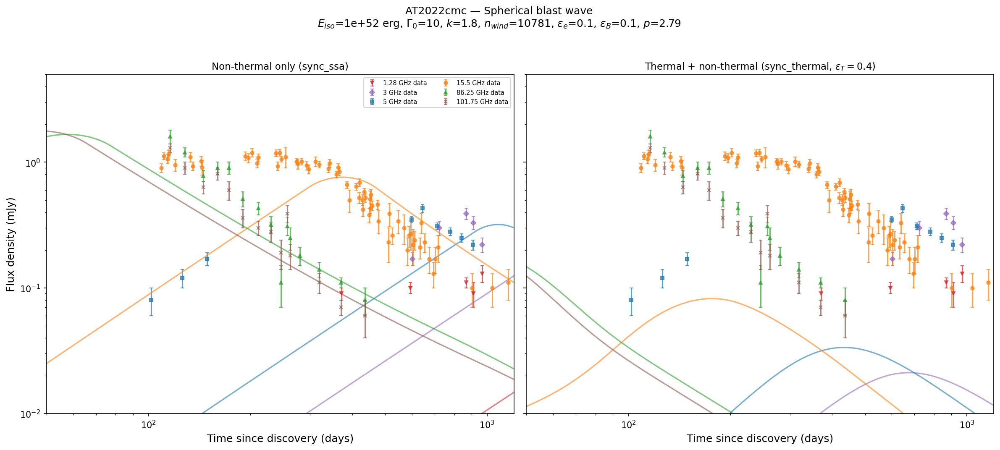

# AT2022cmc: Thermal Electrons in a Relativistic TDE

This example demonstrates the `sync_thermal` radiation model by modeling the radio emission from the jetted tidal disruption event (TDE) AT2022cmc, comparing non-thermal only vs thermal+non-thermal synchrotron.

## Background

AT2022cmc was discovered on 2022 February 11 at redshift $z = 1.193$ ($d_L \approx 8260$ Mpc). It was identified as only the fourth relativistic TDE, with a powerful relativistic jet launched when a star was disrupted by a supermassive black hole. Its multi-frequency radio light curves extend over 3 years, making it an excellent testbed for afterglow models.

Key references:

- Rhodes et al. 2025, ApJ (arXiv:2506.13618) --- 3-year radio monitoring, spherical blast wave modeling with thermal electrons
- Margalit & Quataert 2021, ApJL, 923, L14 --- MQ21 thermal synchrotron formalism
- Ferguson & Margalit 2025 --- FM25 full-volume post-shock extension

## Radio data

We use multi-frequency radio data from Rhodes+2025 (Table 1):

| Telescope | Frequency | Band | Epochs |
|-----------|-----------|------|--------|
| MeerKAT | 1.28 GHz | L-band | 5 detections |
| MeerKAT | 3.0 GHz | S-band | 5 detections |
| e-MERLIN | 5.0 GHz | C-band | 9 detections |
| AMI-LA | 15.5 GHz | Ku-band | ~70 detections |
| NOEMA | 86.25 GHz | 3 mm | 15 detections |
| NOEMA | 101.75 GHz | 3 mm | 14 detections |

## Physical parameters

The paper's best-fit spherical model parameters:

| Parameter | Value | Notes |
|-----------|-------|-------|
| $E_{iso}$ | $10^{52}$ erg | Isotropic-equivalent kinetic energy |
| $\Gamma_0$ | 10 | Initial Lorentz factor |
| $k$ | 1.8 | CSM density power-law index |
| $n_{wind}$ | 10,770 cm$^{-3}$ | Density normalization at $r = 10^{17}$ cm |
| $\epsilon_e$ | 0.1 | Non-thermal electron energy fraction |
| $\epsilon_B$ | 0.1 | Magnetic field energy fraction |
| $p$ | 2.79 | Electron spectral index |
| $\epsilon_T$ | 0.4 | Thermal electron efficiency |
| $z$ | 1.193 | Redshift |

### Density translation

The paper parameterizes the CSM as $n = 191 \, (R/R_{45})^{-1.795}$ where $R_{45} = 9.4 \times 10^{17}$ cm. In blastwave, the density convention is $n(r) = A \cdot (r / 10^{17} \, \mathrm{cm})^{-k}$, so:

$$n_{wind} = 191 \times 9.4^{1.8} \approx 10{,}770$$

## Computing the model

```python
import numpy as np
from blastwave import FluxDensity_spherical
from scipy.integrate import quad

DAY = 86400.0

# Cosmology
z = 1.193
def luminosity_distance(z, H0=70.0, Om=0.3):
    OL = 1.0 - Om
    c_km_s = 299792.458
    result, _ = quad(lambda zp: 1.0 / np.sqrt(Om * (1 + zp)**3 + OL), 0, z)
    return (c_km_s / H0) * (1 + z) * result

d_L = luminosity_distance(z)

nwind = 191.0 * (9.4)**1.8

P = {
    "Eiso": 1e52, "lf": 10.0,
    "A": nwind, "n0": 0.0,
    "eps_e": 0.1, "eps_b": 0.1, "eps_T": 0.4,
    "p": 2.79,
    "theta_v": 0.0, "d": d_L, "z": z,
}

t_model = np.geomspace(50 * DAY, 1200 * DAY, 200)

# Non-thermal only
F_ssa = FluxDensity_spherical(
    t_model, 15.5e9 * np.ones_like(t_model), P,
    k=1.8, tmin=1.0, tmax=1500 * DAY, model="sync_ssa",
)

# Thermal + non-thermal
F_thermal = FluxDensity_spherical(
    t_model, 15.5e9 * np.ones_like(t_model), P,
    k=1.8, tmin=1.0, tmax=1500 * DAY, model="sync_thermal",
)
```

Key choices:

- **`Spherical` profile** --- isotropic energy, 1-cell tophat fast path
- **`k=1.8`** --- wind-like CSM ($n \propto r^{-1.8}$)
- **`model="sync_thermal"`** --- MQ21 thermal + non-thermal synchrotron with self-absorption
- **`eps_T=0.4`** --- thermal electron efficiency from the paper's fit

## Thermal vs non-thermal comparison

The `sync_thermal` model (Margalit & Quataert 2021) self-consistently computes:

1. **Thermal electrons**: a relativistic Maxwellian distribution at the post-shock temperature, producing a thermal synchrotron bump
2. **Non-thermal electrons**: the usual power-law tail ($\propto \gamma^{-p}$) with fraction $\delta = \epsilon_e / \epsilon_T$
3. **Self-absorption**: both thermal and non-thermal absorption coefficients

The thermal component steepens the high-frequency spectral index beyond what non-thermal synchrotron alone can produce. This is critical for AT2022cmc, where the NOEMA 86--102 GHz data show a steep decline that pure power-law synchrotron struggles to reproduce.

## Plotting

```python
import matplotlib.pyplot as plt

fig, axes = plt.subplots(1, 2, figsize=(16, 7), sharey=True)
t_days = t_model / DAY

# Left: non-thermal only
axes[0].plot(t_days, F_ssa, '-', color='C1')
axes[0].set_title('Non-thermal only (sync_ssa)')

# Right: thermal + non-thermal
axes[1].plot(t_days, F_thermal, '-', color='C1')
axes[1].set_title('Thermal + non-thermal (sync_thermal)')

for ax in axes:
    ax.set_xscale('log')
    ax.set_yscale('log')
    ax.set_xlabel('Time since discovery (days)')
axes[0].set_ylabel('Flux density (mJy)')

plt.tight_layout()
plt.savefig('at2022cmc_radio.png', dpi=150)
```



## Discussion

The thermal electron model improves the fit in two ways:

1. **High-frequency suppression**: the thermal synchrotron spectrum has an exponential cutoff above the thermal peak frequency $\nu_\Theta$, naturally steepening the mm-band light curves
2. **Self-consistent SSA**: thermal electrons contribute additional absorption at low frequencies, affecting the SSA turnover

### Limitations

- The spherical blast wave is an approximation --- the actual jet is likely structured
- The MQ21 formalism assumes a single-zone post-shock region with uniform $\Theta$
- The density power-law index $k = 1.8$ is approximate; the true CSM profile may be more complex
- Parameter degeneracies exist between $\epsilon_T$, $\epsilon_e$, and $\epsilon_B$

## Full script

The complete analysis script is at [`examples/at2022cmc_radio.py`](https://github.com/nuclear-multimessenger-astronomy/blastwave/blob/main/examples/at2022cmc_radio.py). To regenerate the plot:

```bash
python examples/at2022cmc_radio.py
```
