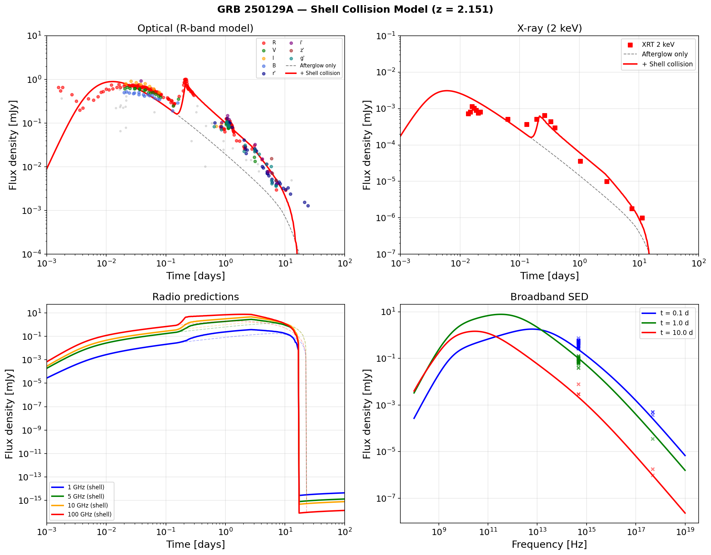
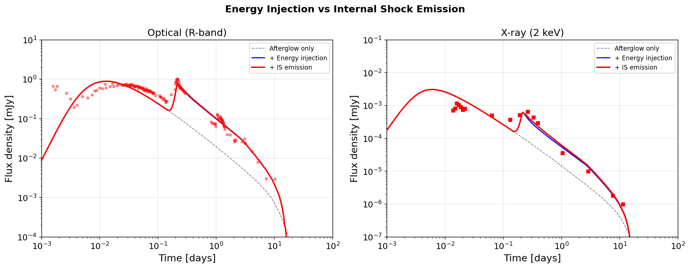

# GRB 250129A: Shell Collisions and Internal Shock Emission

This example models the multi-band afterglow of **GRB 250129A** (z = 2.151) using a forward shock with a trailing shell collision. The trailing shell both injects energy into the decelerating blast wave and produces **internal shock (IS) synchrotron emission** from the reverse-shocked shell material.

Reference: Akl et al. 2026, A&A (arXiv:2603.08555)

## Model Overview

The GRB 250129A afterglow shows an early optical/X-ray plateau followed by a standard power-law decay. A single forward shock cannot reproduce the plateau, but a trailing shell collision naturally explains it through two effects:

1. **Energy injection**: The collision deposits kinetic energy into the blast wave, boosting the forward shock emission and flattening the decay.
2. **Internal shock emission**: The reverse shock propagating through the trailing shell heats the shell material, producing a bright synchrotron flash that dominates at early times and decays adiabatically.

## Best-Fit Parameters

| Parameter | Symbol | Value |
|:----------|:-------|:------|
| Isotropic energy | \(E_\mathrm{iso}\) | \(2 \times 10^{52}\) erg |
| Initial Lorentz factor | \(\Gamma_0\) | 80 |
| ISM density | \(n_0\) | 2.0 cm\(^{-3}\) |
| Electron energy fraction | \(\varepsilon_e\) | 0.07 |
| Magnetic energy fraction | \(\varepsilon_B\) | \(2 \times 10^{-3}\) |
| Electron spectral index | \(p\) | 2.5 |
| Jet half-opening angle | \(\theta_j\) | 12° |
| Viewing angle | \(\theta_\mathrm{obs}\) | 0.5° |
| Redshift | \(z\) | 2.151 |
| Luminosity distance | \(d_L\) | 5145 Mpc |

**Trailing shell:**

| Parameter | Value |
|:----------|:------|
| Shell energy | \(1.5 \times 10^{52}\) erg |
| Shell Lorentz factor | 100 |
| Launch time | 5000 s |

**Collision microphysics:**

| Parameter | Value |
|:----------|:------|
| \(\varepsilon_{e,\mathrm{coll}}\) | 0.3 |
| \(\varepsilon_{B,\mathrm{coll}}\) | 0.01 |
| \(p_\mathrm{coll}\) | 2.5 |

## Code

```python
import numpy as np
from blastwave import Jet, TopHat, ForwardJetRes

theta_j = np.deg2rad(12)

jet = Jet(
    TopHat(theta_j, 2e52, lf0=80),
    nwind=0.0, nism=2.0,
    tmin=1.0, tmax=200 * 86400, spread_mode="ode",
    eps_e=0.07, eps_b=2e-3, p_fwd=2.5,
    grid=ForwardJetRes(theta_j, 129),
    trailing_shells=[(1.5e52, 100, 5000)],
    eps_e_coll=0.3, eps_b_coll=0.01, p_coll=2.5,
)

P = dict(
    theta_obs=np.deg2rad(0.5), theta_v=np.deg2rad(0.5),
    Eiso=2e52, lf=80, theta_c=theta_j,
    n0=2.0, A=0.0, p=2.5, eps_e=0.07, eps_b=2e-3,
    d=5145.0, z=2.151,
)

t = np.geomspace(100, 200 * 86400, 300)
flux_optical = jet.FluxDensity(t, 4.68e14, P)   # R-band
flux_xray = jet.FluxDensity(t, 4.84e17, P)      # 2 keV
```

## Multi-Band Light Curves



**Top left (Optical)**: The R-band model (red) matches the observed optical decay from ~0.01 to 30 days. The early data (<0.01 days) likely includes prompt/reverse shock emission not captured by this model.

**Top right (X-ray)**: The shell collision creates a plateau at ~0.01–0.1 days that matches the XRT data. The late-time decay follows the standard forward shock prediction.

**Bottom left (Radio)**: Predicted radio light curves at 1, 5, 10, and 100 GHz. The shell collision enhances the early radio emission, with the peak shifting to later times at lower frequencies due to synchrotron self-absorption.

**Bottom right (SED)**: Broadband spectral energy distributions at 0.1, 1, and 10 days showing the evolution from the IS-dominated early phase to the forward-shock-dominated late phase.

## Energy Injection vs Internal Shock Emission



This figure separates the two effects of the shell collision:

- **Dashed gray**: Afterglow only (no trailing shell). The forward shock decays monotonically.
- **Blue**: Energy injection only (`eps_e_coll=0`). The collision deposits energy into the blast wave, boosting the forward shock. This primarily affects the late-time normalization.
- **Red**: Full model with IS emission. The reverse-shocked shell material produces a bright synchrotron flash that creates the observed early bump/plateau, especially prominent in X-rays.

The IS emission dominates at early times (\(t \lesssim 0.3\) days) while the energy-injected forward shock takes over at late times. In the X-ray panel, the IS emission clearly produces the observed plateau at ~0.01–0.1 days.

## Internal Shock Physics

When the trailing shell (Lorentz factor \(\Gamma_2 = 100\)) catches the decelerating blast wave (Lorentz factor \(\Gamma_1 \sim 10\text{--}50\)), the relative Lorentz factor is:

\[
\Gamma_\mathrm{rel} = \Gamma_1 \Gamma_2 (1 - \beta_1 \beta_2)
\]

The collision sends a reverse shock through the trailing shell, heating the material to:

- Post-shock density: \(n'_3 = 4 \Gamma_\mathrm{rel} \, n_\mathrm{lab} / \Gamma_2\)
- Magnetic field: \(B' = \sqrt{8\pi \varepsilon_{B,\mathrm{coll}} \, e'}\)
- Minimum electron Lorentz factor: \(\gamma_m = \frac{p-2}{p-1} \varepsilon_{e,\mathrm{coll}} \frac{m_p}{m_e} (\Gamma_\mathrm{rel} - 1) + 1\)

After the collision, the shocked shell material expands adiabatically:

\[
n' \propto R^{-3}, \quad e' \propto R^{-4}, \quad B' \propto R^{-2}, \quad \gamma_m \propto R^{-1}
\]

The IS emission is computed on the same forward-mapping grid as the forward shock, with full EATS integration over the jet surface.

## Full Script

The complete script is at [`examples/grb250129a.py`](https://github.com/nuclear-multimessenger-astronomy/blastwave/blob/main/examples/grb250129a.py). Observational data from Akl et al. (2026) is in [`data/grb250129a.csv`](https://github.com/nuclear-multimessenger-astronomy/blastwave/blob/main/data/grb250129a.csv).

```bash
python examples/grb250129a.py
```
